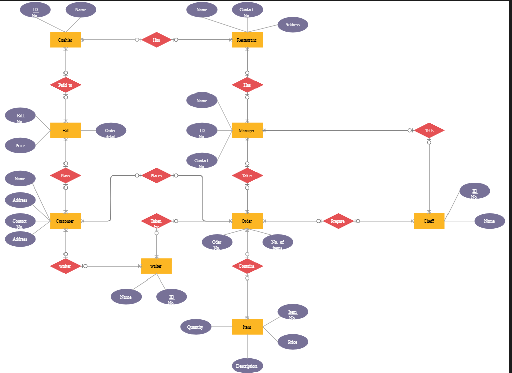

# Software Requirements Specification (SRS)

## Preface

This document provides the Software Requirements Specification (SRS) for the Restaurant Management System. It defines the system’s functionalities, performance criteria, security requirements, and overall system architecture necessary for development, specifically focusing on managing food items, menus, user roles (Admin, Employee, Customer), orders, and restaurant operations as referenced in **Screenshot 2026-05-30 012626.png**.

---

## Version History

* **Version 1.0** – Initial Draft based on core script structures.
* **Version 1.1** – Added detailed non-functional requirements and restaurant workflow validations.
* **Version 1.2** – Refined class-to-requirement mappings and execution constraints.

---

## 1. Introduction

### Purpose

The Restaurant Management System is a comprehensive digital solution designed to streamline restaurant operations, automate menu handling, track active employee records, and facilitate frictionless customer ordering processes.

### Document Conventions

This document follows the IEEE SRS standard, using:

* **Must** – Indicates mandatory requirements.
* **Should** – Indicates recommended features.
* **May** – Indicates optional enhancements.

### Intended Audience and Reading Suggestions

* **Project Managers & Developers** – For object-oriented system implementation guidance matching Python backend classes.
* **Stakeholders & Business Analysts** – To understand workflow boundaries for admins, staff, and customers.
* **Testers & QA Teams** – To validate compliance, boundary limits, and console-driven menu choices.

### Scope

The system provides:

* Unified database control for Food Items (Name, Price, Quantity Available)
* Dynamic Menu structures allowing full CRUD operations by authorized entities
* Dynamic Order validation checking against physical stock boundaries
* User Account segmentation separating Customer actions, Employee tracking, and administrative overrides
* Automated billing pipelines calculating real-time aggregates

### References

* IEEE Standard 830-1998 (Software Requirements Specification)
* File structure definitions from **Screenshot 2026-05-30 012626.png** (`FoodItems.py`, `main.py`, `Orders.py`, `Users.py`, `Restaurent.py`, `Menu.py`)

---

## 2. Overall Description

### Product Perspective

The Restaurant Management System is an architectural software framework mapping directly to distinct object modules. It operates standalone to parse inputs from terminals or connected interface forms, processing state information down to core execution engines like `Amiyo Restaurent`.

### Product Functions

* **Menu Control Engine:** Adding new dishes, editing dynamic pricing, and removing deprecated options.
* **Cart & Stock Coordination:** Staging desired menu selections, preventing quantity over-allocation, and depleting stock numbers upon successful purchase validation.
* **Employee Directory Tracking:** Managing employee background variables including name, email, phone, age, specific organizational designation, and base salary.
* **Billing Registry:** Summing current item prices multiplied by chosen counts, handling payment confirmations, and clearing operational cache structures.

### User Classes and Characteristics

* **Admin:** Retains supreme operational authorization. Capable of altering overall system stock, dropping menu entries, and provisioning employee data structures.
* **Employee:** Operational user background node tracking inside the system records.
* **Customer:** Frontend actor accessing system menus, configuring local operational carts, verifying price estimates, and finalizing transactional orders.

### Operating Environment

* Cross-platform console or text-based interface application runtime layer.
* **Database/Storage Infrastructure:** Python Object Memory collections structured to map cleanly into NoSQL engines or related document stores.

### Design and Implementation Constraints

* Memory-state variable mapping requires strict typing isolation to prevent object shadowing during multi-user loops (e.g., separating user actions from system class definitions).
* Stock counts must never fall beneath absolute numerical zero boundaries.

### Assumptions and Dependencies

* Local runtime platforms process basic loops and integer transformations efficiently without data corruption.

---

## 3. System Requirements Specification

### Functional Requirements

* **User Categorization & Initial Setup**
* The system **must** capture user metadata parameters (Name, Email, Phone, Address) at runtime initialization.
* The system **must** map runtime sessions strictly to selected abstract user implementations (Admin, Customer).


* **Menu Management**
* The system **must** provide case-insensitive search capability to look up food items by target name.
* Admins **must** be able to instantiate fresh `FoodItem` objects and push them into the global menu list.
* Admins **must** be able to purge obsolete items completely from visibility.


* **Order Processing & Cart Control**
* The system **must** match desired purchase quantities against true menu stock availability.
* The system **must** output an explicit error message ("Item Quantity Exceeded !!") if a user requests more stock than currently available.
* Cart operations **must** isolate item price metrics from variable state fluctuations in the primary inventory directory.
* The system **must** calculate checkout totals using the explicit formula:

$$\text{Total Price} = \sum (\text{Item Price} \times \text{Selected Quantity})$$


* **Employee Operations Management**
* The system **must** allow admins to add new staff elements detailing Name, Phone, Email, Designation, Age, and Salary.
* The system **must** provide a secure presentation routine listing all registered team members.


---

## 4. System Models

### ER Diagram Image



```
